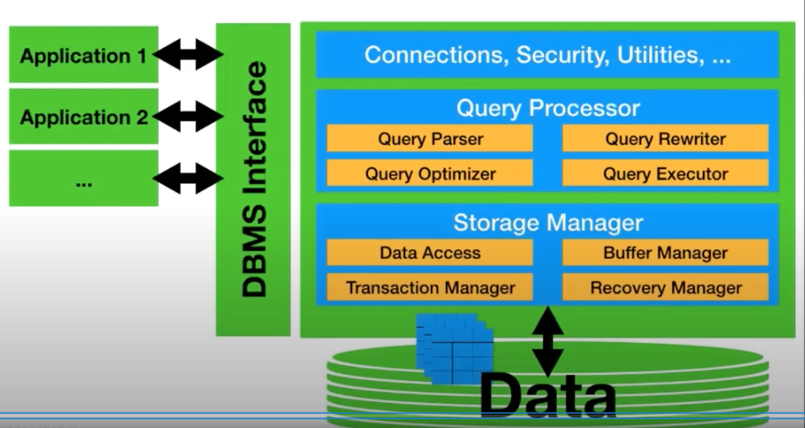

DBMS:

-   Storage Manager
-   Query Processor
-   Other stuff

# 1. DBMSS Interface

It is SQL. What SQL can do ?

-   Define db schema
    -   Create data tables(columns, type of columns, …)
    -   Define constraint, relationship on/between each table
-   Constraint:
    -   Primary key: define subset of columns as unique identifier for a row (in a table)- - Foreign key: define subset of columns refer to a subset of columns (UNIQUE constraint) in another table.
-   Data manipulation
    -   Insert/ delete/ update/ create rows in a table
-   Data analysis
    -   Aggregate functions such as SUM, COUNT, MAX, MIN, …
    -   Some helper keywords: LIMIT, GROUP BY, ORDER BY
        Nesting queries

# 2. Data storage

-   Hardware
    

    -   Design motivation
        -   Database needs large capacity => need lower hierarchy storage type
        -   Access speed may become bottleneck => need algo to minimize data movement
        -   Keep related data close together, read the whole as pages instead of single bit or byte (as those storage random access is expensive)
    -   Hard disk: typically used as physical storage.
        

            -   Sector is characteristics of disk & can’t be changed
            -   Disk blocks (pages) == multiple of sectors (the number can be set when init). It is **smallest unit of data being read from or written to disk**
            -   Disk arm can be directly set to a specific length, then the spindle rotate such that disk head can find the data
            -   We try to store related data closed together on disk. Close means that the disk head takes least time to move between blocks of data.

-   Format

    -   Table schema is stored in “database catalog”
    -   Each table is divided into pages (smallest data unit in DB). There are 2 representation of pages:
        

        -   As linked list:
            -   Each page contains pointers to next/prior page
            -   Page can be full or partially empty
            -   Header’s reference saved in DB catalog

        

        -   Via directories
            -   Each directory store pointer to page

    -   Each page is divided into **slots** (1 row in table). Each slots is divided into **fields** (1 field (col) in 1 row). Both of these division above can be implemented as fixed or variable length content for each slot/ field

    -   Above is the “row stores” strategy; data in the same row close together. We can do it by column stores also; data in the same column close tgt

-   Data access

    -   Faster data retrieving: **Index**

        -   Auxiliary data structure that has <em>search key</em> and <em>pointer to data address</em>. <em>search key</em> is stored in sorted order.
        -   2 types of implementation:

            -   B-tree
                -   Content of inner node: store search key and reference to page containing search keys which are greater than its key
                -   Content of leaf node: store search key and real physical address/ or the real data of that search key
                -   This implementation can be used for both equality or inequality queries (== or >, <, >=, <=)

        -   Hash index
            -   Only useful for equality conditions
                -   Static hashing
                -   Extendible hashing: use more bit of hashed value in case of overflow
                -   Linear hashing

# 3. Transaction

-   ACID guarantees
    -   Atomicity: execute the whole transaction or none
    -   Consistency: preserve predefined constraint of each field
    -   Isolation: transactions don’t affect correct result of each other. In other words, they are executed as if in a serial way, which move the DB from consistent state to another one
    -   Durability: ensure commited data never lost

## 1. **Isolation**

-   Isolation anomalies: destroy illusion of sequential execution

    1. <em>Dirty read</em>: read data from uncommitted transactions
    2. <em>Unrepeatable read</em>: <em> different rows' value (still get same set of rows)</em> retrieved from different times of reading
       `Rx(A) UPDATE(A) Cy Rx(A)`
    3. <em>Phantom problem</em>: quite related to <em>unrepeatable read</em>. We get <em> different set of rows (new rows are inserted). The old rows still keep the same value </em> `Rx(A) INSERT/ DELETE(A) Cy Rx(A)`
    4. <em>Lost updates</em>: unsaved changes overridden by other transaction
       `Wx(A) Wy(A)`

    5. Write skew: this is not defined in SQL official. Yet, it is still important. If 2 transactions happen at the same time & both write to the same data. Then 1 will fail

-   <em>Issolation level</em> (can be set globally/ for each transaction; depending on application type)
    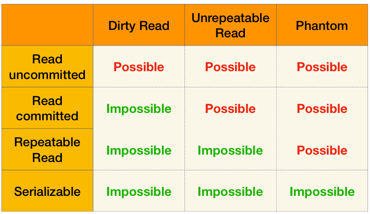

    -   Concurrency control will pick the best scheduling based on isolation level set
    -   Type of schedules:

        1.  Check for **serializability** (ignore aborts at first)

            -   **serial schedule** is the standard (which remains the DB consistent state if all transaction preserves the consistency)
            -   **Serializability** is the ability of a schedule that can be **equipvalence** with a **serial schedule** (in terms of db state, data values)

            

            -   **There** are 2 **equipvalence** types, which meet the requirement of **serializable isolation level**:
                -   <em>View equipvalence</em>: 2 schedules are view equip if it has the same _"view" (do read & write operation)_ on every object value
                -   <em>Conflict equipvalence</em>: 2 schedules are conflict equip if it has the _same chronological execution order_ of pair of conflicting operations (`RW`, `WR`, `WW` on a object) (for every object)
            -   A schedule is <em>view/conflict equipvalence</em> to a serial schedule is called <em>view/conflict serializability</em> schedule.
            -   Verifying view serializability is NP-hard problem, yet conflict one is much ezier (can draw conflicting graph to determine)

        2.  When handling aborts (obvious truth: once commit cannot abort)

            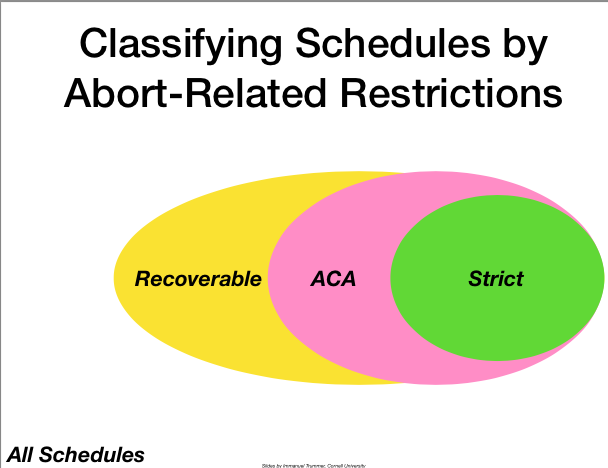
            

            -   Recoverable schedule: Transaction only commits after all others which it read from. (i.e: `R1(A) W1(A) R2(A) C1 C2`)
            -   ACA schedule: no transaction reads uncommitted data
                -   the recoverable one might lead to situation of 1 trans abortion leading to other abort
                -   The above example, if T1 aborts, T2 will do so too
            -   Strict schedule: no transaction reads and writes uncommitted data
                -   this type is eziest to do clean up abort

    -   Protocols to ensure the desired schedule

        1.  Lock-based

            -   Pros & cons:
                -   pros: proactively avoid conflicts when they are likely
                -   cons: locking overhead & potential deadlocks
            -   2 types of lock: can be applied on different objects or the whole DB
                | Lock type | Read | Write |
                |-----------|------|-------|
                | Read | v | x |
                | Write | x | x |

                (only read-read lock alow. RW, WR, WW is not allowed)

                -   Read (shared) lock
                -   Write (exclusive) lock

            -   Types of protocol:

                -   Ways of acquiring locks
                    -   Acquire all locks at start and release all at the end of transaction
                    -   Acquire lock late & release lock early
                -   2 phase locking (2PL) protocols (**always ensure (conflict) serializability**)
                    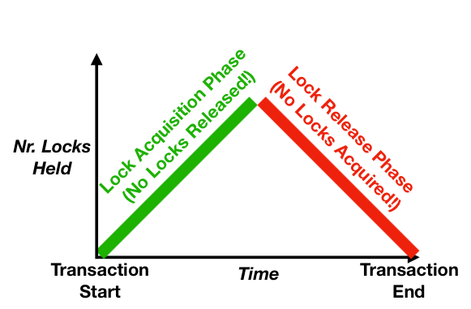

                    -   2 variants:

                        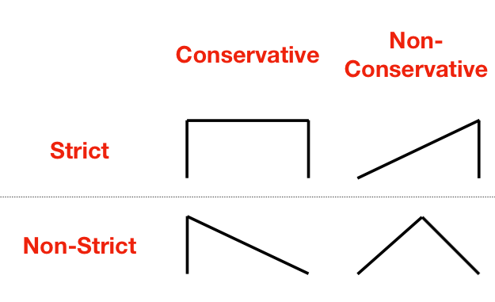

                        -   Strict 2PL: release all locks at the end (avoid cascading aborts)
                        -   Conservative 2PL: acquire all locks at the start (avoid dead lock)

                    -   Being both non strict &/or conservative may allow more parralel but deadlock and/or cascading aborts might happen
                    -   The optimal one depends on how often dead lock and cascading aborts happen

                -   Multi-granularity lock protocols

                    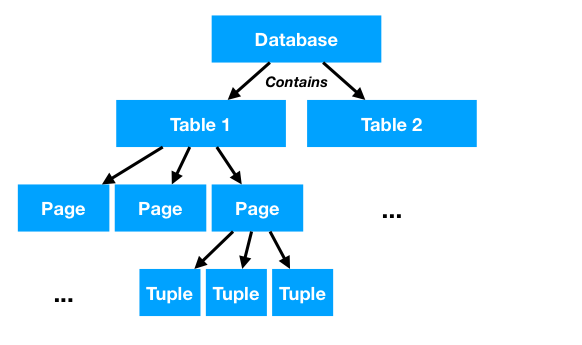

                    -   Exploit the hierachy of DB objects, locking on an object also implies lock on its children. This strategy should be used with 2PL protocol

                    -   Introduces 2 new types of lock:
                        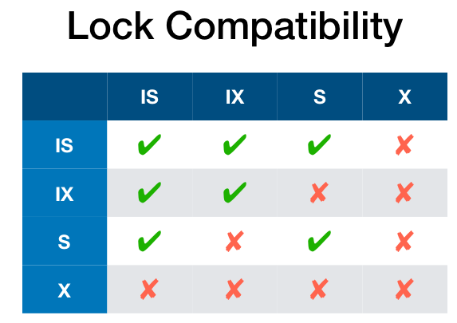

                        -   IS (Intention Shared): want shared lock on contained objects
                        -   IX (Intention Exclusive): want exclusive lock on contained objects

                    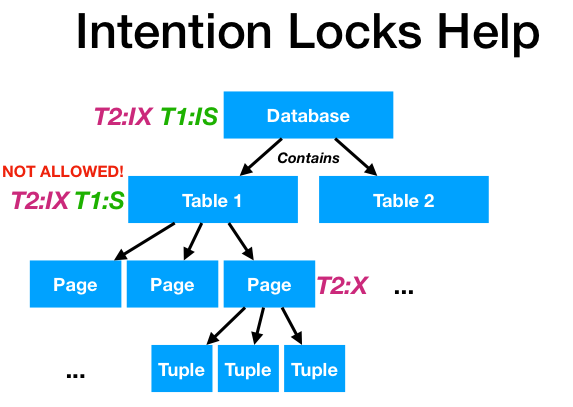

                    _T1 want S lock on a Page and T2 want X lock on the same page_

                    -   It means that a transaction wants to obtain S (X) lock on an object, it should obtain IS (IX, respectively) on ALL ancestors of that object
                    -   Pros & cons:
                        -   pros: increase degree of parallelism
                        -   cons: increases locking overheads

            -   Some problems:

                -   Deadlocks: transactions waiting in loop

                    -   2 ways of solving deadlocks:

                        -   Detect & resolve
                            -   Detect: Wait for timeout or maintain waits graph
                            -   Resolve: abort deadlocked transactions until complete resolve
                        -   Prevent:

                            -   Give locks for transactions safely based on protocol. There re 2 of them:
                                -   wound-wait
                                    -   T1 causes T2 abort if T1 has higher priority
                                    -   T1 waits for lock from T2 if T1 has lower priority
                                -   wait-die
                                    -   T1 waits for lock from T2 if T1 has higher priority
                                    -   T1 aborts itself if it has lower priority than T2

                            Just like many other mechanisms, each has pros & cons.

                -   Phantoms: `R1(A) W2(A) C2 R1(A) ...` 2 different reads have 2 different results
                    -   To avoid phantoms:
                        -   Predicate locking: Instead of lock only some specific rows, we lock everything satisfying the predicate. (i.e: predicate "starts with F"). _Yet, this method can be complex when the predicate becomes complex_
                        -   Index locking: when inserting new values, it also need to update the index. By locking index, we block the new update queries
                    -   Efficient index locking
                        -   Index look-up
                            -   Identify next node (child node or root at start)
                            -   Lock next (read lock), then unlock parent
                            -   repeat ...
                        -   Index update
                            -   when updating index, the changes may propagate up until it meets a safe node (half-full < size of that node < full )
                            -   Hence, :
                                -   do the same as index look-up, but only unlock parent if it is a safe node
                                -   execpt for _leaf node_, which using _write_ lock. Other can use either of:
                                    -   write lock (more safe)
                                    -   read lock (more concurrency, but might lead to abortion if it propagates up to a node also written by another transaction)\

        2.  Without locking

            -   Pros & cons:
                -   pros: faster when conflicts are rare
                -   cons:
                    -   keep track of TS of each object
                    -   need to restart if conflicts happen
            -   Types:

                _Each transactions assigned a time-stamp (TS) at start-up.
                All of the following strategies try to serialize transactions in TS order to get serializability_

                1.  Optimistic

                        - keep track of list of objects which are read and written to
                        - there re 3 phases:
                            - **read** relevant data and do transaction on a private copy
                            - **validate** check if this transaction's actions conflict with others
                                -  If TS(Ti) < TS(Tj). No conflict means that any modification by Ti is not visible to Tj.
                            - **write** publish local change if no conflicts

                2.  Time-stamps based

                    -   Each object is associated with **last read and write time-stamp** (RTS, and WTS)
                    -   A transaction T, which has TS(T):

                        -   wants to read object A iff TS(T) > WTS(A)
                        -   wants to write object A iff TS(T) > RTS(A)
                            (when TS(T) < WTS(A), this new write action is ignored ,made obsolete and so called Thomas write>)

                        else, it will be aborted and restarted with larger TS

                3.  Multi-versions

                    -   Each object is kept mutiple versions based on TS it is updated. And also value RTS & WTS of each object
                    -   A transaction T, which has TS(T):

                        -   wants to read object A, then **never be blocked**; always get the version whose TS right precedes to the read time
                        -   wants to write object A iff TS(T) > RTS(A), else aborted and restarted. Successful write action also update RTS and WTS.

## 2. Durability & Atomicity

-   Challenges:

    1.  Durability: comnmited transaction need to be persisted

        -   Normally changes are written into main memory, which is volatile

        => Update actual data (even small one) into real db, on hard disk, be4 commit ?

            -> bad performance as too many write pages

            -> have to undo if transaction is aborted

    2.  Atomicity: no transaction is partially executed

        -   Leave all changes into main memory until commit ?

        => main mem is low in capacity, hence, _low parallelism, low through put_

    |                            | Save all changes in RAM until commit | No above          |
    | -------------------------- | ------------------------------------ | ----------------- |
    | Save every changes in disk | Low throughput & response time       | Low response time |
    | No above                   | Low throughput                       | **Optimal**       |

    Optimal one is mixed betweenn these 2, it is so called **write-ahead logging**

-   Write-ahead logging:

    -   Instead of storing real data directly into db, only store these changes - **deltas** in log
        -   Many **deltas** can be written into _1 page_, instead of happening on _multiple pages_ in case of real data write
    -   Moreover, storing **deltas** only happening when _swapping out buffer pages (RAM) for ongoing transaction_ :

        -   In addition to store these **deltas**, we also store info about how these deltas is made (as these **deltas** can be uncommited data)

        > In short, logging contains 2 main things: **undo** and **redo** info. For example, conceptually:

             A log record is stored in hard disk when a buffer page swapped out:

                How these changes made: (undo info - written first)
                    action: Ai -> Aj
                    transaction: Tx
                Data changes: (redo info)
                    - address: 0x123
                    changes: 1234
                    - address: 03456
                    changes: 981x

    -   This logging strategy bounded by 2 rules:

        -   write all logs entries _of a transaction_ before commiting (for **redo**)
        -   write all logs entries _of a buffer page_ before persisting these data (for **undo**)

-   ARIES algo: popular algo for recoverability, which uses write-ahead logging.

# 4. Database design

## 1. Requirement Analysis (biz process)

## 2. Conceptual Design (Model DB via ER diagrams)

1.  ER diagram

    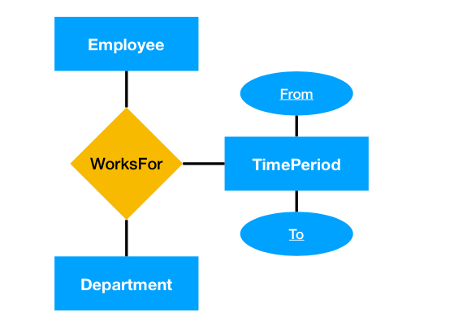

    -   Entity:
        -   type of an object; entity set is multiple entities of the same type
        -   weak entities: identified by another ("owner") entity via relationship. (e.g: classes and student id. Student id can be same in different classes but it is unique in each class)
        -   sub-classes
    -   Attribute: property bounded to an entity
    -   Relationships:
        -   connect 2 or more entities with each other (can involve attributes/entities in as well)
        -   can specify number per entity (1:1, 1:n, n:1, or n:m)

    **Choosing between entity and attribute?**

    e.g: model addresses of employee entity as attribute or entity?

    As an attribute cannot have multiple values, so:

        - if an employee has multiple addresses -> model address as entity
        - else -> model it as attribute

2.  Translating ER diagram to relation (representation in real DB)

    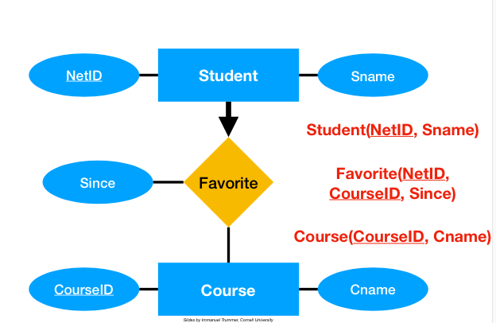
    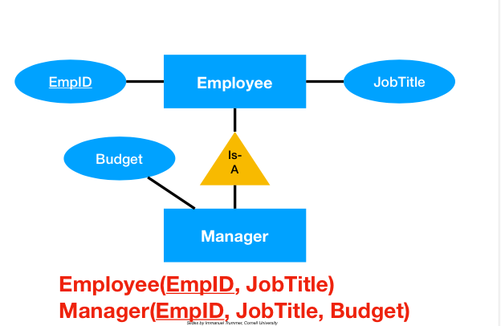

    -   Each entity

        -   Becomes a row
        -   Each attribute becomes a column of each row. Then, an attribute might be _primary key_.

        The above rules can be applied in case of _sub-classes_ and _weak entities_. Each weak entity need to have _foreign key_ connecting back to the owner. Each sub-class might need more attributes than its parent

    -   Each relationship
        -   Becomes a row.
        -   Store all _primary key_ of all attributes connected as rows
        -   Additional attributes are stored as rows also

## 3. Schema normalization

From the step 2 of above the point above. We get the (sub-optimal) schema. This step avoids the data redundacy

1.  **Functional dependency (FD)**

    -   X -> Y means that a value in column X can define one in column Y

    -   Redundancy in a table:
        -   Happens when X -> Y and X is stored multiple times
        -   Anomalies:
            -   Update, insert, and delete: done in multiple places
            -   Deletion might cause lost information
    -   To find all FD from 2 sources:

        -   domain knowledge
        -   inferring from existing FD (has some rules to get. e.g: A-> B, B->C then A->C, ...)

2.  **Normal forms**

-   Some useful side things:

    1. To check for **(candidate) key**:

        - **We aim to find AC for each left-hand sided attribute in given FD**. If an attribute closure is a key, it can determine all other attributes
        - Attribute closure (AC), which is given attribute ABC what are the others we can get.

        e.g: Given F = {A → D, AB → E, BI → E, CD → I, E → C}
        Then AE closure is (ACDEI). So AE is not key
        but ABE closure is (ABCDEI). So ABE is the key.

    2. To get the **minimal cover FDs**

        - Right hand side of each FD is a single attribute
        - Check if any FDs are trivial -> delete
        - Check LHS of each FD if some attribute can be removed

    3. Some annotations used in the following:
        - Capital letter (X) contains multiple small attributes. while small one (b) is an attribute
        - Candidate key a minimal set of attributes can unquely define other keys

-   To avoid redundancy, we decompose the table to some normalization forms. When decomposing table. Take note of 2 things:

    -   **lossless joining**: when joining back, no data is loss
    -   **dependency preserve**: suppose table R decomposed into X, Y. If we enforce all FD from attributes in X and Y; and do the same with R, we have 2 same set of FD

-   Form used in practice

    1. BCNF form

        _(no redundancy but might lose dependency preserve)_

        For all FD, X -> b, in each table. That table is in BCNF form if:

        - b is trivial of X, or
        - X is a super key (= candidate key + other attributes)

    1. 3rd form

        _(allow some redundancy but preserve dependencies)_

        For all FD, X -> b, in each table. That table is in 3rd form if:

        - b is trivial of X, or
        - X contains a key, or
        - b is a prime key (one key belongs to a candidate key)

-   Algo to achieve these forms

    -   BCNF

        -   for each FD that violates BCNF rules X -> Y in table R. We split table R into 2 tables: XY and R-X

            e.g: X -> Y, table XYABC. Then 2 new tables: XY, XABC

    -   3rd
        -   Same as above, but with 1 more extension, to preserve dependency:
            -   Get the set of **minimal cover FDs**
            -   Check if any FD X->Y is lost. Then add a new table (relation) XY

## 4. Physical tuning

(Index related stuff)
