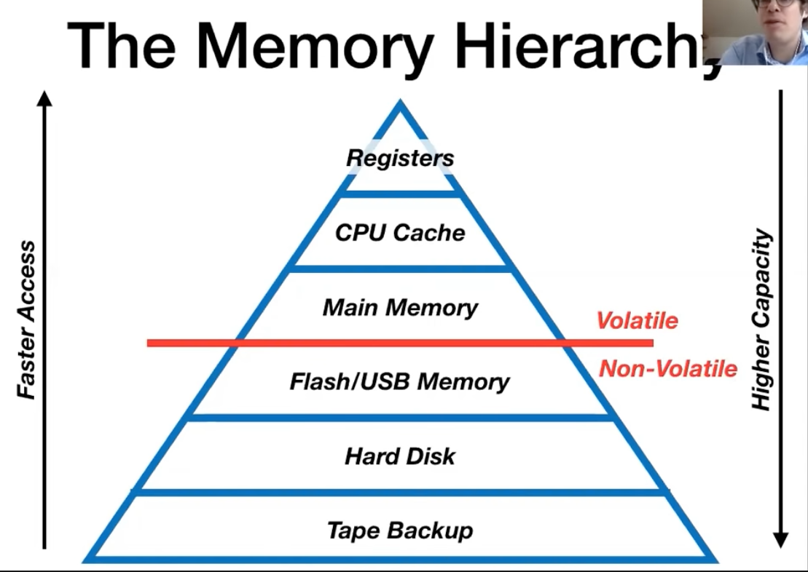
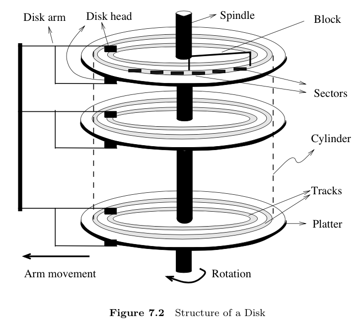
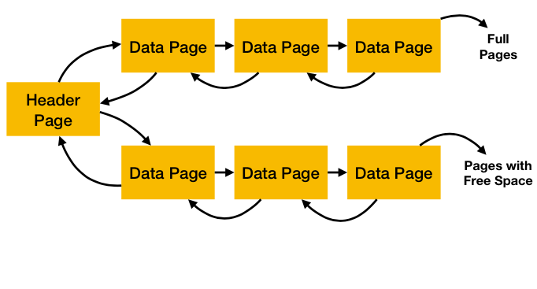
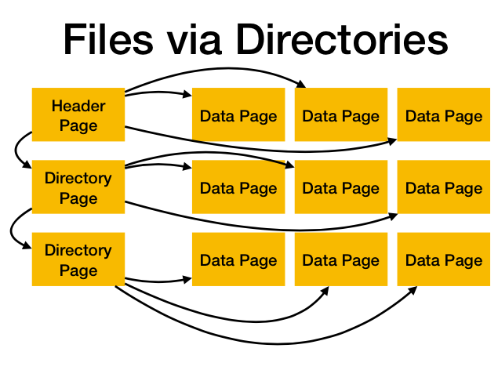

DBMS:

-   Storage Manager
-   Query Processor
-   Other stuff

# 1. DBMSS Interface

It is SQL. What SQL can do ?

-   Define db schema
    -   Create data tables(columns, type of columns, …)
    -   Define constraint, relationship on/between each table
-   Constraint:
    -   Primary key: define subset of columns as unique identifier for a row (in a table)- - Foreign key: define subset of columns refer to a subset of columns (UNIQUE constraint) in another table.
-   Data manipulation
    -   Insert/ delete/ update/ create rows in a table
-   Data analysis
    -   Aggregate functions such as SUM, COUNT, MAX, MIN, …
    -   Some helper keywords: LIMIT, GROUP BY, ORDER BY
        Nesting queries

# 2. Data storage

-   Hardware
    

    -   Design motivation
        -   Database needs large capacity => need lower hierarchy storage type
        -   Access speed may become bottleneck => need algo to minimize data movement
        -   Keep related data close together, read the whole as pages instead of single bit or byte (as those storage random access is expensive)
    -   Hard disk: typically used as physical storage.
        

            -   Sector is characteristics of disk & can’t be changed
            -   Disk blocks (pages) == multiple of sectors (the number can be set when init). It is **smallest unit of data being read from or written to disk**
            -   Disk arm can be directly set to a specific length, then the spindle rotate such that disk head can find the data
            -   We try to store related data closed together on disk. Close means that the disk head takes least time to move between blocks of data.

-   Format

    -   Table schema is stored in “database catalog”
    -   Each table is divided into pages (smallest data unit in DB). There are 2 representation of pages:

            -   As linked list:

        

                -   Each page contains pointers to next/prior page
                -   Page can be full or partially empty
                -   Header’s reference saved in DB catalog
            -   Via directories

        

                -   Each directory store pointer to page

    -   Each page is divided into **slots** (1 row in table). Each slots is divided into **fields** (1 field (col) in 1 row). Both of these division above can be implemented as fixed or variable length content for each slot/ field

    -   Above is the “row stores” strategy; data in the same row close together. We can do it by column stores also; data in the same column close tgt

-   Data access

    -   Faster data retrieving: **Index**

        -   Auxiliary data structure that has <e>search key</e> and <e>pointer to data address</e>. <e>search key</e> is stored in sorted order.
        -   2 types of implementation:

            -   B-tree
                -   Content of inner node: store search key and reference to page containing search keys which are greater than its key
                -   Content of leaf node: store search key and real physical address/ or the real data of that search key
                -   This implementation can be used for both equality or inequality queries (== or >, <, >=, <=)

        -   Hash index
            -   Only useful for equality conditions
                -   Static hashing
                -   Extendible hashing: use more bit of hashed value in case of overflow
                -   Linear hashing

# 3. Transaction

-   ACID guarantees
    -   Atomicity: execute the whole transaction or none
    -   Consistency: preserve predefined constraint of each field
    -   Isolation: other transactions don’t affect correct result of each other
    -   Durability: ensure updated data never lost
-   **Isolation** :

    -   Isolation anomalies: destroy illusion of sequential execution

        -   <e>Dirty read</e>: read data from uncommitted transactions
        -   <e>Unrepeatable read</e>: inconsistent row retrieved from different times of reading
            `Rx(A) Wy(A) Cy Rx(A)` [due to commit committed `WRITE` actions in between]
        -   <e>Phantom problem</e>: similar to unrepeatable read, but due to commited `UPDATE` or `DELETE` actions
        -   <e>Lost updates</e>: unsaved changes overridden by other transaction
            `Wx(A) Wy(A)`
